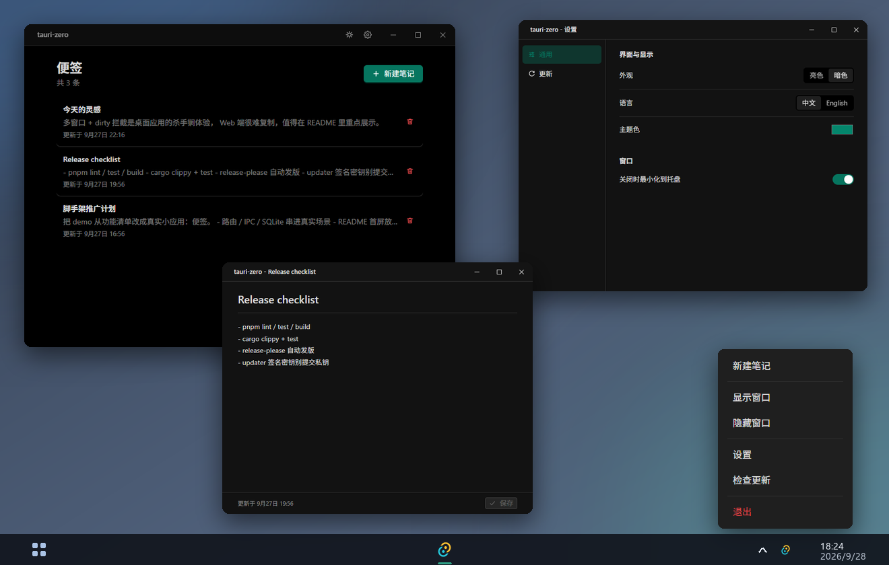

# tauri-zero

> 零配置、零样板、零决策的 Tauri 2 + React 19 桌面应用脚手架（starter / boilerplate / template）。clone 即用，你只写业务。
> Zero-config Tauri 2 + React 19 desktop app starter: routing, state, i18n, SQLite, auto-update & CI/CD out of the box.

[](https://github.com/TheShining/tauri-zero/actions/workflows/ci.yml)
[](LICENSE)



## 为什么是 tauri-zero / Why tauri-zero

`create-tauri-app` 给你一个能跑的空白模板；tauri-zero 给你一个能交付的应用骨架。

`create-tauri-app` gives you a blank template that runs; tauri-zero gives you a production-ready app skeleton.

路由、状态、请求、国际化、日志、错误处理、CSP 安全、CI/CD、自动更新——这些"标配"都替你配好了。

Routing, state, requests, i18n, logging, error handling, CSP security, CI/CD, auto-update — all wired up for you.

- **个人开发者 / Indie developers**：5 分钟起一个结构清晰、工程化完备的桌面应用。
- **企业团队 / Teams**：直接获得 lint / format / commit 规范 / 测试 / CI / 自动更新的完整质量门禁。

## 内置演示：一个真实的便签小应用 / Built-in demo: a real notes app

clone 后 `pnpm tauri dev` 看到的是一个可直接使用的便签应用：主窗口是笔记列表，双击笔记弹出独立编辑窗口（未保存关闭拦截、Ctrl+S 保存），托盘可一键新建；头部只保留明暗切换和设置齿轮两个快捷入口，设置是以独立窗口呈现的（左侧菜单 + 分组行式布局）。路由、状态、IPC、SQLite、多窗口、托盘——所有能力都串在真实场景里，而不是按钮墙。

After cloning, `pnpm tauri dev` opens a working notes app: the main window lists notes, double-clicking one opens a standalone editor window (unsaved-change interception, Ctrl+S to save), and the tray offers one-click note creation. The header keeps only two shortcuts — theme toggle and a settings gear — and settings live in their own standalone window (side menu plus grouped rows). Routing, state, IPC, SQLite, multi-window, tray — everything is woven into real scenarios instead of a wall of buttons.


## 特性 / Features

**前端 / Frontend** — react-router v8 · zustand v5 · plugin-http 请求层 · Ant Design v6 · i18next 中英双语 · ErrorBoundary

**Rust 端 / Backend** — domain/platform 模块化架构 · sqlx migrations · thiserror 统一错误 · 状态拆分 · tauri-plugin-log · CSP 安全加固

**工程化 / Engineering** — ESLint 10 + Prettier 3 + Stylelint 17 · commitlint + git hooks · 多环境变量 · React Compiler

**持久化与发布 / Persistence & Release** — sqlx + SQLite · 文件系统/对话框/通知/剪贴板/Shell 插件 · 三平台 CI/CD + release-please + 自动更新

## 快速开始 / Quick Start

```bash
git clone https://github.com/TheShining/tauri-zero.git
cd tauri-zero
pnpm install
pnpm tauri dev
```

需要 Node ≥ 22、pnpm ≥ 9、Rust stable。

Requires Node ≥ 22, pnpm ≥ 9, and Rust stable.

## 使用指南 / Guides

完整的功能使用说明见 [guide/](guide/README.md)：路由、状态管理、请求层、国际化、Rust 命令、SQLite 持久化、系统插件、自动更新、环境变量、测试与 CI/CD。接入自己的业务前先读 [guide/customize.md](guide/customize.md)——demo 便签应用哪些可删、如何换成你的领域。

See [guide/](guide/README.md) for full docs: routing, state, requests, i18n, Rust commands, SQLite, plugins, auto-update, env vars, testing & CI/CD. Before wiring in your own business, read [guide/customize.md](guide/customize.md) — what in the demo is safe to replace and how.

## 目录结构 / Structure

```
tauri-zero/
├── src/                 # 前端源码（api / components / pages / router / stores / locales）
│   └── pages/notes/     # demo 便签应用：列表 + 独立编辑窗口（接入时整体替换即可）
├── src-tauri/           # Rust 端（domain / platform / state / migrations / capabilities）
├── guide/               # 使用指南 / user guides
├── .github/workflows/   # CI / release 工作流
├── CONTRIBUTING.md
└── LICENSE
```

## 贡献 / Contributing

欢迎贡献，请先阅读 [CONTRIBUTING.md](CONTRIBUTING.md)。

## License

[MIT](LICENSE)
